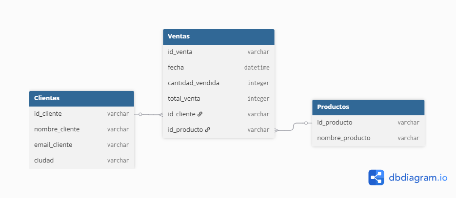

# Mi Portafolio de Data Professional - Maryori Montoya

¡Bienvenida! En este repositorio documento mi camino hacia el dominio de la Ingeniería de Datos y el Análisis de Negocio.

## Proyecto 1: Modelado de Datos (Esquema Estrella)
En este proyecto diseñé la arquitectura de datos para una tienda de retail. 
- **Objetivo:** Optimizar el almacenamiento y facilitar el análisis de ventas.
- **Estructura:** Una tabla de Hechos (Ventas) conectada a dimensiones (Clientes y Productos) mediante relaciones 1:M.
- **Herramienta:** dbdiagram.io

